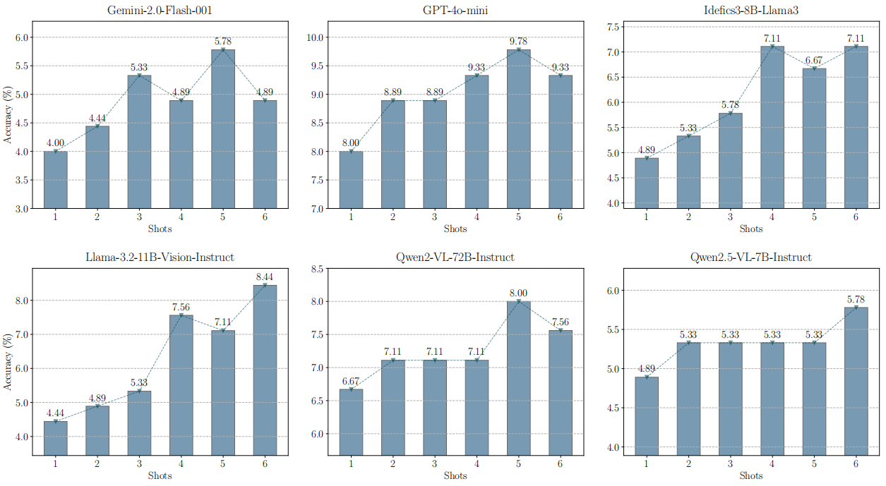

## Texture or Semantics? Vision-Language Models Get Lost in Font Recognition

------------------------------------------------------------------------------------------------------------------

This is the repository for our paper [Texture or Semantics? Vision-Language Models Get Lost in Font Recognition](https://arxiv.org/abs/2503.23768)

When you are reading a research paper or doing some design work, do you ever want to know what font is used in the figure or design? We do, and we find it annoying that current vision-language models (VLMs) even struggle to provide a similar font type as the final answer.

In this paper, we propose a simple yet meaningful font recognition benchmark, which contains 15 popular fonts specifically designed for vision-language models (VLMs). We set two levels of challenges for VLMs: the easy version consists of regular sentences, while the hard version includes the font name in the image to introduce a stroop effect, which can be challenging for the model but easy for humans to recognize as a trap.


------------------------------------------------------------------------------------------------------------------

#### Run Codes

##### 1. Install Packages

```bash
pip install -r requirements.txt
```

##### 2. OpenAI & HuggingFace & OpenRouter

- Use the ``config.yaml`` file to set your different api keys.

```bash
openai:
  api_key: "YOUR_API_KEY"
  organization: "YOUR_ORGANIZATION"
huggingface:
  api_key: "YOUR_API_KEY"
openrouter:
  api_key: "YOUR_API_KEY"
```

##### 3. Dataset

- Download all corresponding ``.ttf`` files to the ``./Fonts`` directory and run the following command.

```bash
python generate.py
```

##### 4. Experiments

- The code examples for running experiments are already provided in the ``command.py`` file.
- To run the few-shot experiments, you need to execute ``python search.py`` first to construct the few-shot demonstrations.
- You can add your own commands to the ``command.py`` file and run them using ``python command.py``.

------------------------------------------------------------------------------------------------------------------

#### Experimental Results

In conclusion, current vision-language models (VLMs) struggle with this task under different inference settings, even with the 15 popular fonts considered, and are highly vulnerable to the stroop effect.


We also conduct few-shot tests on six different models with different architectures and still obtain disappointing results.



------------------------------------------------------------------------------------------------------------------

#### Attention Analysis

We conduct attention analysis on two different models, and the results shed light on the inherent limitations of vision-language models (VLMs) in capturing semantic features. These models struggle to focus on the crucial edge regions, making it difficult for them to produce correct answers.


------------------------------------------------------------------------------------------------------------------

#### Questions?

If you have any questions related to the repo or the paper, or you encounter any problems when using the code, feel free to email Zhecheng Li (zhl186@ucsd.edu).